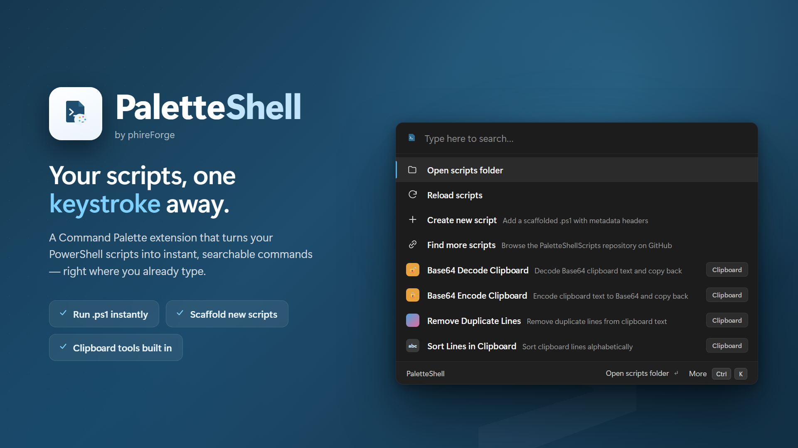

# PaletteShell Extension



**PaletteShell** is a [Windows Command Palette](https://learn.microsoft.com/windows/powertoys/command-palette/overview) extension that lets you run custom PowerShell scripts directly from the Command Palette. Transform clipboard text, generate GUIDs, format JSON, and automate your daily workflows — all without leaving your keyboard.

> 💡 Looking for ready-made scripts? Browse the community script library at **[paletteshell/PaletteShellScripts](https://github.com/paletteshell/PaletteShellScripts)** — also reachable from inside the palette via the **"Find more scripts"** command.

## 🌟 Features

- **🚀 Quick Access**: Run PowerShell scripts directly from the Windows Command Palette
- **📋 Clipboard Utilities**: Transform and manipulate clipboard text with one keystroke
- **🔧 Customizable**: Drop your own `.ps1` files into a folder and they show up automatically
- **📝 Parameter Support**: Scripts with parameters get an interactive input form, generated from the script's own `param()` block
- **🎨 Rich Metadata**: Organize scripts with icons, descriptions, groups, and tags via PowerShell attributes
- **📄 Markdown Output**: Render a script's output as formatted Markdown inside the palette
- **📜 List Output**: Turn a script into a search/pick provider — its stdout becomes a searchable list of items you can copy or open
- **✏️ Open in Editor**: Jump straight to any script's source in your `$EDITOR`/`$VISUAL` (Notepad by default)
- **⚡ Cross-Platform PowerShell**: Supports both PowerShell Core (`pwsh`) and Windows PowerShell (`powershell`)
- **🔒 Security**: Runs in user context with optional admin elevation per script

## 📖 Overview

PaletteShell turns a folder of PowerShell scripts into searchable, runnable commands inside the Windows Command Palette. Each `.ps1` file becomes a list item: PaletteShell reads metadata out of the script (its synopsis, description, icon, parameters, and behavior attributes) and presents it with a friendly title and subtitle. Selecting an item either runs the script immediately or — if the script declares parameters — opens a form to collect input first.

Scripts live in **`Documents\PaletteShellScripts`**. This folder is created automatically the first time the extension loads, and a set of ready-to-use sample scripts plus the supporting `PaletteScriptAttributes.psm1` module are copied in for you. Add, edit, or remove files in that folder at any time; use **"Reload scripts"** in the palette to pick up changes.

## ⚙️ How It Works

### Discovery

When the extension is activated, `PaletteShellExtensionPage` does the following:

1. Creates the `Documents\PaletteShellScripts` directory if it doesn't exist.
2. Copies the embedded sample scripts (only files that aren't already there, so your edits are never overwritten).
3. Copies the `PaletteScriptAttributes.psm1` module and `TextCopy.dll` next to the scripts so they're available at runtime.
4. Enumerates every `*.ps1` file in the folder (top level only) and builds the command list.

The list always begins with four built-in actions:

- **Open scripts folder** — opens `Documents\PaletteShellScripts` in Explorer.
- **Reload scripts** — re-scans the folder so new or changed scripts appear.
- **Create new script** — opens a guided wizard that scaffolds a new `.ps1` with metadata headers.
- **Find more scripts** — opens the community [PaletteShellScripts](https://github.com/paletteshell/PaletteShellScripts) repository in your browser.

Every script item also carries an **Open in editor** context command that opens the source file in your preferred editor.

> ℹ️ New scripts and edits are picked up only when you run **"Reload scripts"** — this is intentional, not a bug.

### Parsing the manifest

For each script, `PowerShellScriptParser` parses the file using the official PowerShell AST parser (`System.Management.Automation.Language.Parser`) — it never executes the script just to read metadata. From the AST it extracts:

- **Title** from the comment-based help `.SYNOPSIS` (falls back to the file name).
- **Description** from `.DESCRIPTION`.
- **Parameters** from the `param()` block, including type, default value, whether it's mandatory, and validation info (`[ValidateSet(...)]` becomes a dropdown, `[ValidateRange(...)]` becomes min/max bounds).
- **Behavior attributes** such as host, working directory, timeout, output mode, icon, environment variables, and elevation (see the [attribute reference](#available-attributes)).
- **Elevation** from either the `[RequiresElevation()]` attribute or the built-in `#Requires -RunAsAdministrator` directive.

### Running a script

Selecting a script item routes to one of these paths, based on its metadata:

- **Has parameters** → opens `ScriptParameterFormPage`, an auto-generated form. Once you submit, the collected values are passed to the script.
- **No parameters, `[ScriptOutput('Markdown')]`** → opens `ScriptMarkdownPage`, which runs the script and renders its stdout as formatted Markdown.
- **No parameters, `[ScriptOutput('List')]`** → opens `ScriptListPage`, which runs the script and turns its stdout into a searchable list of items (see [List output](#list-output)).
- **No parameters, any other output mode** → runs the script directly via `RunScriptCommand`.

Execution is handled by `ScriptRunner`, which launches `pwsh.exe` (or `powershell.exe`) with `-STA -NoProfile -ExecutionPolicy Bypass`. When the `PaletteScriptAttributes.psm1` module is present alongside the script, the runner imports it and dot-sources the script so the custom attributes resolve and the helper functions (clipboard, logging) are available; the information stream is redirected to stdout so `Write-Host` output is captured.

Whether PaletteShell waits for the script depends on its output mode and timeout:

| Condition | Behavior |
|-----------|----------|
| `[ScriptOutput('None')]` and no `[ScriptTimeout]` | Fire-and-forget — the process is started and a "Script completed" toast is shown. |
| Any other output mode (`Toast`/`Clipboard`/`Markdown`/`File`) | PaletteShell waits (up to the declared timeout, or a 30s default), captures stdout/stderr, and surfaces the result. |
| `[ScriptTimeout(ms)]` set | PaletteShell waits up to `ms`, then kills the process tree on timeout. |
| `[ScriptOutput('Clipboard')]` | Captured output is copied to the clipboard. |
| `[ScriptOutput('Markdown')]` | Captured output is rendered as Markdown on its own page. |
| `[ScriptOutput('List')]` | Captured output is parsed into a searchable list of selectable items on its own page. |
| `[ScriptOutput('File')]` | Captured output is written to a temp file and opened in your editor. |
| `[RequiresElevation()]` / `#Requires -RunAsAdministrator` | The process is launched elevated (`runas`); output capture is unavailable in this mode. |

### Cross-platform clipboard

The bundled `PaletteScriptAttributes.psm1` module exposes `Get-ClipboardText` / `Set-ClipboardText`, which use the [TextCopy](https://github.com/CopyText/TextCopy) library with a Windows Forms fallback. The host extension also uses TextCopy when copying captured output to the clipboard.

## 🚀 Getting Started

1. Install the extension (from the Microsoft Store, or by building and deploying the MSIX package — see [Building](#-building-from-source)).
2. Open the Command Palette and type **PaletteShell**.
3. Browse the bundled sample scripts, choose **Create new script** to scaffold your own, or **Find more scripts** to grab one from the [community repo](https://github.com/paletteshell/PaletteShellScripts).
4. Edit your scripts in `Documents\PaletteShellScripts` and run **Reload scripts** to see changes.

## ✍️ Creating Your Own Scripts

You can use the in-palette **Create new script** wizard, or simply drop a `.ps1` file into `Documents\PaletteShellScripts`. Scripts use PowerShell attributes for metadata. A typical script looks like:

```powershell
using module .\PaletteScriptAttributes.psm1

<#
.SYNOPSIS
    Brief description (becomes the command title)
.DESCRIPTION
    Detailed description of what this script does (becomes the subtitle)
.PARAMETER MyParameter
    Parameter description (shown in the input form)
#>
[ScriptHost('pwsh')]
[ScriptCwd('{ScriptDir}')]
[ScriptGroup('Category')]
[ScriptIcon('🎯')]
[ScriptTimeout(15000)]
[ScriptOutput('Clipboard')]
[CmdletBinding()]
param(
    [Parameter(Mandatory=$true)]
    [string]$MyParameter
)

# Your code here
$result = $MyParameter.ToUpper()
Set-ClipboardText $result
```

### Available Attributes

| Attribute | Purpose |
|-----------|---------|
| `[ScriptHost('pwsh')]` | Host to run under: `'pwsh'` (default) or `'powershell'` |
| `[ScriptCwd('{ScriptDir}')]` | Working directory (supports path tokens, below) |
| `[RequiresElevation()]` | Run the script with administrator rights |
| `[ScriptTimeout(30000)]` | Timeout in milliseconds; also forces wait-and-capture |
| `[ScriptGroup('Category')]` | Group/category name (shown as a tag) |
| `[ScriptIcon('🚀')]` | Icon emoji or glyph shown in the palette |
| `[ScriptOutput('None')]` | Output mode (see below) |
| `[ScriptEnv('VAR', 'value')]` | Set an environment variable (repeat for multiple) |

### Path Tokens

`[ScriptCwd(...)]` and `[ScriptEnv(...)]` values support these tokens, expanded at runtime:

- `{ScriptDir}` — the folder containing the script
- `{Home}` — the current user's profile folder
- `{Temp}` — the system temp folder

### Output Modes

- **None** — run silently; show a "Script completed" toast (default)
- **Clipboard** — copy captured output to the clipboard
- **Toast** — show the captured output in a Windows notification
- **Markdown** — run the script and render its output as formatted Markdown on its own page
- **List** — parse the script's output into a searchable list of selectable items, turning the script into a search/pick provider (see [List output](#list-output))
- **File** — write captured output to a temp file and open it in your editor (`$VISUAL`/`$EDITOR`, else Notepad). Best for large or structured output that's unwieldy in a toast. Append an extension hint after a colon to control the file type:

  ```powershell
  [ScriptOutput('File')]        # → %TEMP%\PaletteShell\<name>-<ts>.txt, opened in editor
  [ScriptOutput('File:csv')]    # → .csv, so it opens in Excel
  [ScriptOutput('File:json')]   # → .json, for syntax-highlighted JSON
  ```

### List output

`[ScriptOutput('List')]` turns a script into a **search/pick provider**: PaletteShell runs the script, parses its stdout into a list of items, and opens a searchable page where each item can be picked. Picking an item **copies its value**; items that carry a URL also get an **Open** command. This is the power mode — e.g. "list my Git branches → pick one → copy".

PaletteShell parses stdout in one of two shapes:

- **Newline-delimited text** — each non-empty line becomes an item whose title and copy value are that line. Great for simple scripts (`git branch --format='%(refname:short)'`, `Get-ChildItem -Name`, …).
- **A JSON array** — for richer items. Print a single JSON array (e.g. via `ConvertTo-Json`):
  - An array of **strings** behaves like the line case (the string is both title and copy value).
  - An array of **objects** maps these fields (all optional, case-insensitive):

    | Field | Purpose |
    |-------|---------|
    | `title` / `name` / `label` / `text` | Item title (also the copy value if `value` is omitted) |
    | `subtitle` / `description` / `detail` | Secondary line under the title |
    | `value` / `copy` | The text copied when the item is picked |
    | `url` / `link` | Adds an **Open** command that launches the URL |
    | `icon` | Emoji or glyph shown on the item |

#### Static list vs. live provider

Whether the list is fixed or driven by what you type depends on the script's `param()` block:

- **No parameter** → the script runs once and the palette's search box **filters the results locally** (e.g. a fixed list of branches you scroll/filter).
- **One parameter** → the page becomes a **live provider**: the palette's search text is passed to the script as that parameter and the results **refresh as you type**. Type or paste a value (a folder path, a query, …) and the script re-runs. The parameter's `.PARAMETER` help becomes the search box's placeholder. (Only the first parameter is used; List scripts skip the parameter form.)

  > The script also runs once on open, when the search box is empty, so handle the blank case — return a short prompt item ("Type a path…") rather than guessing a default, so the page invites input instead of showing an error.

```powershell
# Static list — search filters the lines locally
[ScriptOutput('List')]
param()
git branch --format='%(refname:short)'

# Live provider — whatever you type is passed as -Query and the list refreshes
<#
.PARAMETER Query
    Type a search term…
#>
[ScriptOutput('List')]
param([string]$Query)

@(
    [pscustomobject]@{ title = "Result for $Query"; subtitle = 'picked → copied'; value = $Query }
) | ConvertTo-Json -AsArray -Compress
```

### Parameter Form Mapping

Parameters in your `param()` block automatically become form fields:

- `[string]` → text box
- `[int]` / `[double]` → number input (honors `[ValidateRange(min, max)]`)
- `[switch]` / `[bool]` → checkbox
- `[ValidateSet('A','B','C')]` → dropdown
- `[Parameter(Mandatory=$true)]` → required field

### Helper Functions

When you `using module .\PaletteScriptAttributes.psm1`, these functions are available:

```powershell
$text = Get-ClipboardText            # read clipboard (cross-platform)
Set-ClipboardText "Hello World"      # write clipboard (cross-platform)
```

## 📦 Sample Scripts

The extension ships with ready-to-use scripts that double as working examples:

| Script | What it does |
|--------|--------------|
| `Base64-Encode` / `Base64-Decode` | Base64 encode/decode the clipboard text |
| `Clipboard-UrlEncode` / `Clipboard-UrlDecode` | URL encode/decode the clipboard text |
| `Json-Format` / `Json-Minify` | Pretty-print or minify clipboard JSON |
| `Clipboard-ToUpperCase` / `Clipboard-ToLowerCase` | Change the case of clipboard text |
| `Clipboard-SortLines` | Sort the lines on the clipboard |
| `Clipboard-RemoveDuplicateLines` | Remove duplicate lines |
| `Clipboard-TrimLines` | Trim whitespace from each line |
| `Clipboard-ToCSV` | Convert clipboard text to CSV |
| `Text-Transform` | Parameterized text transformation (demonstrates the input form) |
| `Generate-GUID` | Generate a new GUID and copy it to the clipboard |
| `Clipboard-UnixTimestamp` | Insert/convert a Unix timestamp |
| `System-Report` | Render a system information report (demonstrates Markdown output) |
| `Export-ProcessList` | Snapshot running processes as CSV and open it in Excel (demonstrates File output) |
| `Git-Branches` | Type a repo folder path and pick one of its branches to copy (demonstrates List output as a live provider) |

For more, browse the community library at **[paletteshell/PaletteShellScripts](https://github.com/paletteshell/PaletteShellScripts)**.

## 🛠️ Building from Source

PaletteShell is a .NET 9 Windows app packaged as an MSIX Command Palette extension.

**Requirements**

- .NET 9 SDK with the Windows 10.0.26100 platform
- Windows 10 (10.0.19041) or later
- [Windows Command Palette](https://learn.microsoft.com/windows/powertoys/command-palette/overview) (PowerToys) installed

**Build**

```powershell
dotnet build PaletteShellExtension/PaletteShellExtension.csproj
```

### Project Structure

| Path | Responsibility |
|------|----------------|
| `PaletteShellExtension.cs` | Extension entry point; provides the commands provider to Command Palette |
| `PaletteShellExtensionCommandsProvider.cs` | Registers the top-level PaletteShell command |
| `Pages/PaletteShellExtensionPage.cs` | Main list page — discovery, sample/module copying, item building |
| `PowerShellScriptParser.cs` | Parses script metadata and parameters from the PowerShell AST |
| `Classes/ScriptManifest.cs`, `ScriptParameter.cs` | Parsed metadata models |
| `Classes/ScriptRunner.cs` | Builds the process and runs scripts (fire-and-forget or wait-and-capture) |
| `Classes/ScriptOutputHandler.cs` | Maps captured output to a result per the script's output mode |
| `Classes/EditorLauncher.cs` | Opens a script in `$VISUAL`/`$EDITOR` (Notepad fallback) |
| `Commands/RunScriptCommand.cs` | Runs a parameterless script and handles output/clipboard/toast |
| `Commands/OpenInEditorCommand.cs`, `OpenFolderCommand.cs`, `OpenLinkCommand.cs`, `ReloadPageCommand.cs` | Built-in and per-item commands |
| `Pages/ScriptParameterFormPage.cs`, `Forms/ScriptParameterForm.cs` | Auto-generated input form for parameterized scripts |
| `Pages/ScriptMarkdownPage.cs` | Runs a script and renders its output as Markdown |
| `Pages/ScriptListPage.cs` | Runs a script and turns its stdout into a searchable, pickable list |
| `Commands/CopyValueCommand.cs` | Copies a List item's value to the clipboard when picked |
| `Pages/NewScriptWizardPage.cs`, `Forms/NewScriptWizardForm.cs` | "Create new script" scaffolding wizard |
| `PaletteScriptAttributes.psm1` | PowerShell module defining the metadata attributes and clipboard/logging helpers |
| `SampleScripts/` | Embedded sample scripts copied to the user's scripts folder |

## 🤝 Community Scripts

The **[PaletteShellScripts](https://github.com/paletteshell/PaletteShellScripts)** repository is a growing, community-maintained collection of scripts ready to drop into your `Documents\PaletteShellScripts` folder. Grab the ones you find useful, or contribute your own. You can open it any time from the palette's **"Find more scripts"** command.

## Need Help?

Check out the bundled sample scripts (in `Documents\PaletteShellScripts` after first run) and the [community repo](https://github.com/paletteshell/PaletteShellScripts) for examples of common patterns and best practices.

## License

Licensed under the [MIT License](LICENSE).
