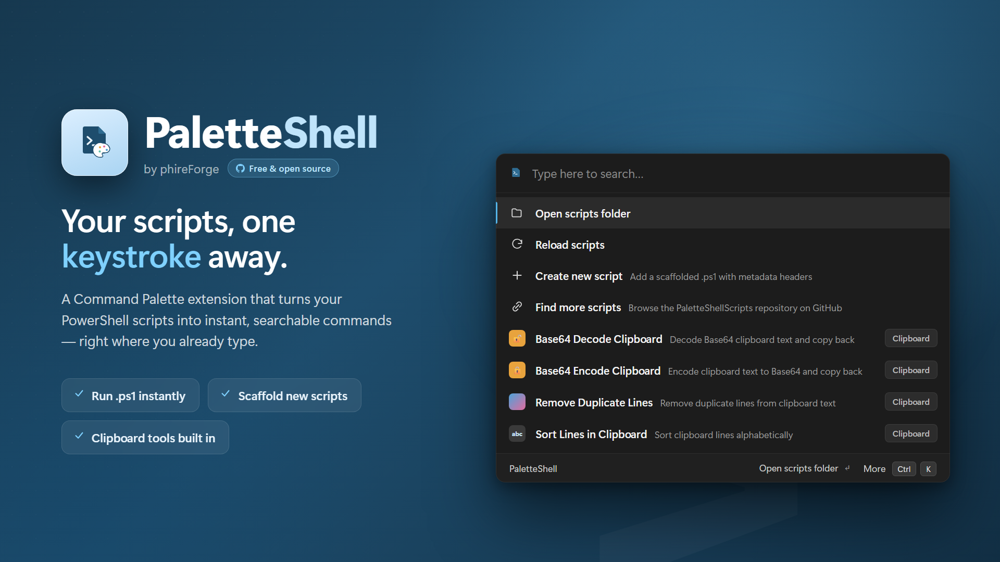

# PaletteShell Extension



**PaletteShell** is a [Windows Command Palette](https://learn.microsoft.com/windows/powertoys/command-palette/overview) extension that lets you run custom PowerShell scripts directly from the Command Palette. Transform clipboard text, generate GUIDs, format JSON, and automate your daily workflows — all without leaving your keyboard.

> 💡 Looking for ready-made scripts? Browse the community script library at **[paletteshell/PaletteShellScripts](https://github.com/paletteshell/PaletteShellScripts)** — also reachable from inside the palette via **"Browse community scripts"**, which opens the Script Manager when installed and falls back to the GitHub repo.

## 🌟 Features

- **🚀 Quick Access**: Run PowerShell scripts directly from the Windows Command Palette
- **📋 Clipboard Utilities**: Transform and manipulate clipboard text with one keystroke
- **📝 Parameter Support**: Scripts with parameters get an interactive input form, generated from the script's own `param()` block
- **🎨 Rich Metadata**: Organize scripts with icons, descriptions, groups, and tags via PowerShell attributes
- **📄 Markdown Output**: Render a script's output as formatted Markdown inside the palette
- **🧮 Result Output**: Show a script's output as a single copyable result — press Enter to copy, "Run again" to regenerate; great for generators like a new GUID, password, or token
- **📜 List Output**: Turn a script into a search/pick provider — its stdout becomes a searchable list of items you can copy or open
- **⏳ Progress Feedback**: A "Running &lt;script&gt;…" spinner shows in the status bar while any script executes, so a slow script no longer looks frozen
- **📌 Pin to Top**: Pin your most-used scripts so they always sort to the top of the list
- **🗂️ Script Management**: Delete a script to the Recycle Bin (with confirmation) or reveal it in File Explorer — right from its context menu
- **☁ Community Script Manager**: Open the companion Script Manager app to browse, install, and update community scripts, with a GitHub fallback when the app isn't installed
- **✏️ Open in Editor**: Jump straight to any script's source in your `$EDITOR`/`$VISUAL` (Notepad by default)
- **⚡ Cross-Platform PowerShell**: Supports both PowerShell Core (`pwsh`) and Windows PowerShell (`powershell`)
- **🤖 AI-Ready**: Ships an `AGENTS.md` authoring spec into your scripts folder so AI coding agents can write compliant scripts for you on the fly
- **🔒 Security**: Runs in user context with optional admin elevation and an optional confirmation prompt per script
- **📁 Configurable Scripts Folder**: Choose where your scripts live the first time you open PaletteShell (or change it later from Settings) instead of being locked to one fixed folder
- **⚙️ Settings**: Set a default script host, default timeout, and preferred editor from PaletteShell's built-in Settings page

## 📖 Overview

PaletteShell turns a folder of PowerShell scripts into searchable, runnable commands inside the Windows Command Palette. Each `.ps1` file becomes a list item: PaletteShell reads metadata out of the script (its synopsis, description, icon, parameters, and behavior attributes) and presents it with a friendly title and subtitle. Selecting an item either runs the script immediately or — if the script declares parameters — opens a form to collect input first.

The first time you open PaletteShell it asks which folder to use for your scripts, suggesting **`Documents\PaletteShellScripts`**. Accept the suggestion or pick your own (e.g. a folder synced across machines); PaletteShell creates it and copies in a set of ready-to-use sample scripts plus the supporting `PaletteScriptAttributes.psm1` module. If you already used PaletteShell before this prompt existed, your existing `Documents\PaletteShellScripts` folder is picked up automatically — no prompt, nothing to redo. Add, edit, or remove files in your scripts folder at any time; use **"Reload scripts"** in the palette to pick up changes (this also picks up a folder you've changed from [Settings](#-settings)).

## ⚙️ How It Works

### Discovery

When the extension is activated, `PaletteShellExtensionPage` does the following:

1. Resolves the scripts folder: the one saved in [Settings](#-settings), or — for an install that predates that setting — the existing `Documents\PaletteShellScripts` if it's already there. If neither exists yet, the page shows a **"Choose scripts folder"** prompt (suggesting `Documents\PaletteShellScripts`) instead of a script list, and the rest of this flow runs once you submit it.
2. Creates that directory if it doesn't exist.
3. Copies the embedded sample scripts (only files that aren't already there, so your edits are never overwritten).
4. Copies the `PaletteScriptAttributes.psm1` module, `TextCopy.dll`, and the `AGENTS.md` authoring spec next to the scripts so they're available at runtime.
5. Enumerates every `*.ps1` file in the folder (top level only) and builds the command list.

The list always begins with these built-in actions:

- **Open scripts folder** — opens your configured scripts folder in Explorer.
- **Open log folder** — opens the diagnostic log folder for script runs and failures.
- **Reload scripts** — re-scans the folder so new or changed scripts appear.
- **Create new script** — opens a guided wizard that scaffolds a new `.ps1` with metadata headers.
- **Browse community scripts** — opens the Script Manager, or falls back to the community [PaletteShellScripts](https://github.com/paletteshell/PaletteShellScripts) repository if it isn't installed.

Every script item carries a context menu (right-click, or the ⋯ commands) with:

- **Pin to top / Unpin** — pins the script so it always sorts above the rest (see [Pinning](#pinning)).
- **Open in editor** — opens the source file in your preferred editor.
- **Reveal in File Explorer** — opens Explorer with the script file selected, for managing it directly.
- **Delete script** — sends the script to the Recycle Bin after a confirmation dialog, then reloads the list.

Scripts are ordered **pinned first, then alphabetically by their displayed title** (the `.SYNOPSIS`, which often differs from the file name). Scripts without a `[ScriptIcon]` get a default terminal glyph so every row is scannable.

If a script fails to parse (e.g. a malformed `param()` block), it isn't dropped silently — it still appears with a **⚠ Couldn't load this script** subtitle and its context menu, so you can open it to fix or delete it.

A script that declares `[RequiresPaletteShellMinimum(...)]` / `[RequiresPaletteShellMaximum(...)]` outside the installed app's version range also stays visible, but shows a **⚠ Requires an update** row (naming the version it needs) instead of running, so you know to update PaletteShell rather than seeing a broken script.

A script that declares no `[ScriptVersion(...)]` is **treated as `1.0.0`** when loaded — the file itself is never rewritten. Scripts scaffolded through the **"Create new script"** wizard get a `[ScriptVersion('1.0.0')]` written in up front, so every managed script carries a version tools can compare.

> ℹ️ New scripts and edits are picked up only when you run **"Reload scripts"** — this is intentional, not a bug. Reloading shows a **"Reloaded N scripts"** toast so you know the rescan ran.

### Parsing the manifest

For each script, `PowerShellScriptParser` parses the file with a lightweight text parser — it never executes the script just to read metadata. From the script text it extracts:

- **Title** from the comment-based help `.SYNOPSIS` (falls back to the file name).
- **Description** from `.DESCRIPTION`.
- **Parameters** from the `param()` block, including type, default value, whether it's mandatory, and validation info (`[ValidateSet(...)]` becomes a dropdown, `[ValidateRange(...)]` becomes min/max bounds).
- **Behavior attributes** such as host, working directory, timeout, output mode, icon, environment variables, elevation, and confirmation (see the [attribute reference](#available-attributes)).
- **Elevation** from either the `[RequiresElevation()]` attribute or the built-in `#Requires -RunAsAdministrator` directive.
- **Confirmation** from the `[ConfirmBeforeRun('message')]` attribute, which gates the run behind a yes/no dialog.

### Running a script

Selecting a script item routes to one of these paths, based on its metadata:

- **Has parameters** → opens `ScriptParameterFormPage`, an auto-generated form. Once you submit, the collected values are passed to the script. `List` scripts are the exception: their first parameter is treated as the search query for live-provider behavior.
- **No parameters, `[ScriptOutput('Markdown')]`** → opens `ScriptMarkdownPage`, which runs the script and renders its stdout as formatted Markdown.
- **No parameters, `[ScriptOutput('Result')]`** → opens `ScriptResultPage`, which runs the script and shows its stdout as a single copyable result (see [Result output](#result-output)).
- **`[ScriptOutput('List')]`** → opens `ScriptListPage`, which runs the script and turns its stdout into a searchable list of items (see [List output](#list-output)).
- **No parameters, any other output mode** → runs the script directly via `RunScriptCommand`.

Execution is handled by `ScriptRunner`, which launches `pwsh.exe` (or `powershell.exe`) with `-STA -NoProfile -ExecutionPolicy Bypass`. When the `PaletteScriptAttributes.psm1` module is present alongside the script, the runner imports it and dot-sources the script so the custom attributes resolve and the helper functions (clipboard, logging) are available; the information stream is redirected to stdout so `Write-Host` output is captured.

While the runner waits on a script, it shows a **"Running &lt;script&gt;…"** spinner in the palette's status bar and clears it when the script finishes. This is built into `ScriptRunner` rather than per-script, so every waited output mode gets the feedback for free — a slow script no longer looks frozen until its toast or page appears.

If a script declares `[ConfirmBeforeRun('message')]`, selecting it first shows a confirmation dialog carrying that message; the script only runs if you accept. For a parameterized script the form is collected first, then the confirmation appears on submit. This pairs naturally with `[RequiresElevation()]` to guard destructive scripts.

Whether PaletteShell waits for the script depends on its output mode and timeout:

| Condition | Behavior |
|-----------|----------|
| `[ScriptOutput('None')]` and no `[ScriptTimeout]` | Fire-and-forget — the process is started and a "Script completed" toast is shown. |
| Any other output mode (`Toast`/`Clipboard`/`Markdown`/`Result`/`List`/`Open`/`File`) | PaletteShell waits (up to the declared timeout, or the [default timeout setting](#-settings), 30s unless changed), captures stdout/stderr, and surfaces the result. |
| `[ScriptTimeout(ms)]` set | PaletteShell waits up to `ms`, then kills the process tree on timeout. |
| `[ScriptOutput('Clipboard')]` | Captured output is copied to the clipboard. |
| `[ScriptOutput('Markdown')]` | Captured output is rendered as Markdown on its own page. |
| `[ScriptOutput('Result')]` | Captured output is shown as a single copyable result on its own page (Enter copies; "Run again" regenerates). |
| `[ScriptOutput('List')]` | Captured output is parsed into a searchable list of selectable items on its own page. |
| `[ScriptOutput('Open')]` | The first non-empty output line is opened as a URL, file, or folder path. |
| `[ScriptOutput('File')]` | Captured output is written to a temp file and opened in your editor. |
| `[ConfirmBeforeRun('msg')]` | Selecting the script prompts a yes/no dialog before it runs. |
| `[RequiresElevation()]` / `#Requires -RunAsAdministrator` | The process is launched elevated (`runas`); output capture is unavailable in this mode, so elevation is only compatible with `[ScriptOutput('None')]`. Combined with any other output mode the script is shown as an incompatible row instead of running. |

### Cross-platform clipboard

The bundled `PaletteScriptAttributes.psm1` module exposes `Get-ClipboardText` / `Set-ClipboardText`, which use the [TextCopy](https://github.com/CopyText/TextCopy) library with a Windows Forms fallback. The host extension also uses TextCopy when copying captured output to the clipboard.

### Pinning

Use a script item's **Pin to top** context command to keep it above the rest of the list; **Unpin** puts it back. Pinning is a per-user UI preference, so it lives outside the `.ps1` files — toggling a pin never rewrites your script. The pinned set is stored in a plain `pinned.txt` alongside your scripts (one entry per line, keyed by the script's path relative to the scripts folder), so it survives reloads and restarts and travels with the folder if you sync or copy it. Renaming or moving a script simply orphans its old pin, which is harmless. Pointing PaletteShell at a **different** scripts folder (see [Settings](#-settings)) works the same way: it's a fresh folder, so it starts with nothing pinned — just re-pin what you need there.

## ⚙️ Settings

PaletteShell's top-level command has a built-in **Settings** page (the gear icon next to it in the Command Palette) with:

| Setting | Purpose |
|---------|---------|
| **Scripts folder** | Where PaletteShell looks for `.ps1` scripts. Changing this doesn't move your existing scripts or `pinned.txt` — run **"Reload scripts"** afterward to point PaletteShell at the new folder. |
| **Default script host** | `Auto` (recommended), `PowerShell 7 (pwsh)`, or `Windows PowerShell 5.1` — used for any script that doesn't declare its own `[ScriptHost(...)]`. |
| **Default timeout** | Milliseconds to wait for a script that doesn't declare its own `[ScriptTimeout(...)]` before treating it as timed out. |
| **Preferred editor** | Command or path used by **"Open in editor"**. Leave blank to fall back to `$VISUAL`, then `$EDITOR`, then Notepad. |

These are extension-wide defaults, not per-script overrides — a script's own `[ScriptHost(...)]`/`[ScriptTimeout(...)]` attributes always win when present. The **"Create new script"** wizard's Host and Timeout fields default to **"Use default (from Settings)"**, so scaffolded scripts pick up whatever you've configured here instead of freezing in a fixed value, unless you explicitly choose otherwise in the wizard.

## 🚀 Getting Started

1. Install the extension (from the Microsoft Store, or by building and deploying the MSIX package — see [Building](#-building-from-source)).
2. Open the Command Palette and type **PaletteShell**.
3. The first time, choose a scripts folder (or accept the suggested `Documents\PaletteShellScripts`).
4. Browse the bundled sample scripts, choose **Create new script** to scaffold your own, or **Browse community scripts** to open the Script Manager or the [community repo](https://github.com/paletteshell/PaletteShellScripts).
5. Edit your scripts in your scripts folder and run **Reload scripts** to see changes.

## ✍️ Creating Your Own Scripts

You can use the in-palette **Create new script** wizard, or simply drop a `.ps1` file into your scripts folder (`Documents\PaletteShellScripts` by default — see [Settings](#-settings)). Scripts use PowerShell attributes for metadata. A typical script looks like:

```powershell
using module .\PaletteScriptAttributes.psm1

<#
.SYNOPSIS
    Brief description (becomes the command title)
.DESCRIPTION
    Detailed description of what this script does (becomes the subtitle)
.PARAMETER MyParameter
    Parameter description (shown in the input form)
#>
[ScriptHost('pwsh')]
[ScriptCwd('{ScriptDir}')]
[ScriptGroup('Category')]
[ScriptIcon('🎯')]
[ScriptTimeout(15000)]
[ScriptOutput('Clipboard')]
[CmdletBinding()]
param(
    [Parameter(Mandatory=$true)]
    [string]$MyParameter
)

# Your code here
$result = $MyParameter.ToUpper()
Set-ClipboardText $result
```

### 🤖 Let an AI agent write scripts for you

PaletteShell ships an [`AGENTS.md`](AGENTS.md) authoring spec and copies it into your scripts folder (kept in sync on every load, right next to `PaletteScriptAttributes.psm1`). It's the full contract for a valid script — the required file shape, every recognized `[Script*]` attribute, output modes, parameter-to-form mapping, and a pre-finish checklist.

Because it lives alongside your scripts, any AI coding agent you point at that folder — Claude Code, Copilot, Cursor, and others that read `AGENTS.md` — discovers the rules automatically and can scaffold new `.ps1` scripts on the fly that PaletteShell loads and runs correctly. Just ask:

> "Write me a PaletteShell script that formats the clipboard as a Markdown table."

The agent reads `AGENTS.md`, produces a compliant script in the folder, and you run **"Reload scripts"** to pick it up. You can also paste the contents of `AGENTS.md` into any chat-based assistant as context if it isn't working directly in the folder.

### Available Attributes

| Attribute | Purpose |
|-----------|---------|
| `[ScriptHost('pwsh')]` | Host to run under: `'pwsh'` or `'powershell'`. Omit it to use the [default script host setting](#-settings) |
| `[ScriptCwd('{ScriptDir}')]` | Working directory (supports path tokens, below) |
| `[RequiresElevation()]` | Run the script with administrator rights |
| `[ConfirmBeforeRun('message')]` | Prompt a yes/no confirmation (with `message`) before running |
| `[ScriptTimeout(30000)]` | Timeout in milliseconds; also forces wait-and-capture. Omit it to use the [default timeout setting](#-settings) |
| `[ScriptGroup('Category')]` | Group/category name for tooling such as the Script Manager catalog browser |
| `[ScriptTags('foo,bar')]` | Comma-delimited free-form tags for tooling such as the Script Manager catalog browser |
| `[ScriptVersion('1.0.0')]` | Script version (SemVer recommended) so tooling can detect when a newer copy is available. A script that omits it is treated as `1.0.0` |
| `[RequiresModule('ImportExcel')]` | PowerShell module the script needs installed (repeat for more than one). Checked before the run — a missing module fails with an `Install-Module -Name … -Scope CurrentUser` hint instead of the script's own cryptic error |
| `[RequiresPaletteShellMinimum('1.2.0')]` | Minimum PaletteShell version required; older installs show a **"Requires an update"** row instead of running |
| `[RequiresPaletteShellMaximum('2.0.0')]` | Maximum PaletteShell version supported; newer installs show a **"Requires an update"** row instead of running |
| `[ScriptIcon('🚀')]` | Icon emoji or glyph shown in the palette |
| `[ScriptOutput('None')]` | Output mode (see below) |
| `[ScriptEnv('VAR', 'value')]` | Set an environment variable (repeat for multiple) |

### Path Tokens

`[ScriptCwd(...)]` and `[ScriptEnv(...)]` values support these tokens, expanded at runtime:

- `{ScriptDir}` — the folder containing the script
- `{Home}` — the current user's profile folder
- `{Temp}` — the system temp folder

### Output Modes

- **None** — run silently; show a "Script completed" toast (default)
- **Clipboard** — copy captured output to the clipboard
- **Toast** — show the captured output in a Windows notification
- **Markdown** — run the script and render its output as formatted Markdown on its own page
- **Result** — run the script and show its output as a single result you can copy (press Enter), with a **Run again** command to regenerate — like a calculator answer. Ideal for generators such as a new GUID, password, or token (see [Result output](#result-output))
- **List** — parse the script's output into a searchable list of selectable items, turning the script into a search/pick provider (see [List output](#list-output))
- **Open** — open the first non-empty output line as a URL, file, or folder path
- **File** — write captured output to a temp file and open it in your editor (`$VISUAL`/`$EDITOR`, else Notepad). Best for large or structured output that's unwieldy in a toast. Append an extension hint after a colon to control the file type:

  ```powershell
  [ScriptOutput('File')]        # → %TEMP%\PaletteShell\<name>-<ts>.txt, opened in editor
  [ScriptOutput('File:csv')]    # → .csv, so it opens in Excel
  [ScriptOutput('File:json')]   # → .json, for syntax-highlighted JSON
  ```

### Result output

`[ScriptOutput('Result')]` runs the script and shows its output as a **single copyable result**, the way a calculator shows an answer. Press **Enter** to copy the value to the clipboard; a secondary **Run again** command re-runs the script in place, so generators can hand you a fresh value without leaving the page.

Print just the value on stdout — that becomes the result. For example, `Generate-GUID.ps1`:

```powershell
[ScriptOutput('Result')]
param()

# Emit just the value; Result mode shows it as a copyable result.
[System.Guid]::NewGuid().ToString()
```

### List output

`[ScriptOutput('List')]` turns a script into a **search/pick provider**: PaletteShell runs the script, parses its stdout into a list of items, and opens a searchable page where each item can be picked. Picking an item **copies its value**; items that carry a URL also get an **Open** command. This is the power mode — e.g. "list my Git branches → pick one → copy".

PaletteShell parses stdout in one of two shapes:

- **Newline-delimited text** — each non-empty line becomes an item whose title and copy value are that line. Great for simple scripts (`git branch --format='%(refname:short)'`, `Get-ChildItem -Name`, …).
- **A JSON array** — for richer items. Print a single JSON array (e.g. via `ConvertTo-Json`):
  - An array of **strings** behaves like the line case (the string is both title and copy value).
  - An array of **objects** maps these fields (all optional, case-insensitive):

    | Field | Purpose |
    |-------|---------|
    | `title` / `name` / `label` / `text` | Item title (also the copy value if `value` is omitted) |
    | `subtitle` / `description` / `detail` | Secondary line under the title |
    | `value` / `copy` | The text copied when the item is picked |
    | `url` / `link` | Adds an **Open** command that launches the URL |
    | `icon` | Emoji or glyph shown on the item |

#### Static list vs. live provider

Whether the list is fixed or driven by what you type depends on the script's `param()` block:

- **No parameter** → the script runs once and the palette's search box **filters the results locally** (e.g. a fixed list of branches you scroll/filter).
- **One parameter** → the page becomes a **live provider**: the palette's search text is passed to the script as that parameter and the results **refresh as you type**. Type or paste a value (a folder path, a query, …) and the script re-runs. The parameter's `.PARAMETER` help becomes the search box's placeholder. (Only the first parameter is used; List scripts skip the parameter form.)

  > The script also runs once on open, when the search box is empty, so handle the blank case — return a short prompt item ("Type a path…") rather than guessing a default, so the page invites input instead of showing an error.

```powershell
# Static list — search filters the lines locally
[ScriptOutput('List')]
param()
git branch --format='%(refname:short)'

# Live provider — whatever you type is passed as -Query and the list refreshes
<#
.PARAMETER Query
    Type a search term…
#>
[ScriptOutput('List')]
param([string]$Query)

@(
    [pscustomobject]@{ title = "Result for $Query"; subtitle = 'picked → copied'; value = $Query }
) | ConvertTo-Json -AsArray -Compress
```

### Open output

`[ScriptOutput('Open')]` runs the script, takes the first non-empty line from stdout, and asks Windows to open it with the default app. The target can be a URL, a file path, or a folder path.

```powershell
[ScriptOutput('Open')]
param()

# Open the user's temp folder.
[System.IO.Path]::GetTempPath()
```

For URLs:

```powershell
[ScriptOutput('Open')]
param()

'https://learn.microsoft.com/windows/powertoys/command-palette/overview'
```

### Confirmation prompts

Add `[ConfirmBeforeRun('message')]` to gate a script behind a yes/no dialog — the natural companion to `[RequiresElevation()]` for destructive scripts. Selecting the script (or, for a parameterized script, submitting the form) shows the dialog with your message; the script runs only if you accept.

```powershell
[RequiresElevation()]
[ConfirmBeforeRun('This permanently deletes the selected files.')]
param([string]$Path)
```

### Parameter Form Mapping

Parameters in your `param()` block automatically become form fields:

- `[string]` → text box
- `[int]` / `[double]` → number input (honors `[ValidateRange(min, max)]`)
- `[switch]` / `[bool]` → checkbox
- `[ValidateSet('A','B','C')]` → dropdown
- `[Parameter(Mandatory=$true)]` → required field

By default a form value reaches the script as a **literal string**. Mark a parameter `[AllowExpression()]` to have its value passed through as an evaluated PowerShell expression instead of being quoted.

### Helper Functions

When you `using module .\PaletteScriptAttributes.psm1`, these functions are available:

```powershell
$text = Get-ClipboardText            # read clipboard (cross-platform)
Set-ClipboardText "Hello World"      # write clipboard (cross-platform)
```

## 📦 Sample Scripts

The extension ships with ready-to-use scripts that double as working examples:

| Script | What it does |
|--------|--------------|
| `Base64-Encode` / `Base64-Decode` | Base64 encode/decode the clipboard text |
| `Clipboard-UrlEncode` / `Clipboard-UrlDecode` | URL encode/decode the clipboard text |
| `Json-Format` / `Json-Minify` | Pretty-print or minify clipboard JSON |
| `Clipboard-ToUpperCase` / `Clipboard-ToLowerCase` | Change the case of clipboard text |
| `Clipboard-SortLines` | Sort the lines on the clipboard |
| `Clipboard-RemoveDuplicateLines` | Remove duplicate lines |
| `Clipboard-TrimLines` | Trim whitespace from each line |
| `Clipboard-ToCSV` | Convert clipboard text to CSV |
| `Clear-TempFiles` | Delete old TEMP files after a confirmation prompt (demonstrates ConfirmBeforeRun on a parameterized script) |
| `Text-Transform` | Parameterized text transformation (demonstrates the input form) |
| `Generate-GUID` | Generate a new GUID and show it as a copyable result (demonstrates Result output) |
| `Clipboard-UnixTimestamp` | Insert/convert a Unix timestamp |
| `System-Report` | Render a system information report (demonstrates Markdown output) |
| `Export-ProcessList` | Snapshot running processes as CSV and open it in Excel (demonstrates File output) |
| `Open-TempFolder` | Open the user's temp folder in File Explorer (demonstrates Open output) |
| `Get-PublicIP` | Look up this machine's public IP and show it as a copyable result (demonstrates Result output) |
| `Git-Branches` | Type a repo folder path and pick one of its branches to copy (demonstrates List output as a live provider) |
| `Restart-Explorer` | Restart the Windows Explorer shell after a confirmation prompt (demonstrates ConfirmBeforeRun) |

For more, browse the community library at **[paletteshell/PaletteShellScripts](https://github.com/paletteshell/PaletteShellScripts)**.

## 🛠️ Building from Source

PaletteShell is a .NET 9 Windows app packaged as an MSIX Command Palette extension. For running
tests, sideloading, and debugging the extension itself, see [CONTRIBUTING.md](CONTRIBUTING.md).

**Requirements**

- .NET 9 SDK with the Windows 10.0.26100 platform
- Windows 10 (10.0.19041) or later
- [Windows Command Palette](https://learn.microsoft.com/windows/powertoys/command-palette/overview) (PowerToys) installed

**Build**

```powershell
dotnet build PaletteShellExtension/PaletteShellExtension.csproj
```

### Project Structure

| Path | Responsibility |
|------|----------------|
| `PaletteShellExtension.cs` | Extension entry point; provides the commands provider to Command Palette |
| `PaletteShellExtensionCommandsProvider.cs` | Registers the top-level PaletteShell command |
| `Pages/PaletteShellExtensionPage.cs` | Main list page — discovery, sample/module/`AGENTS.md` copying, item building |
| `Classes/SampleScriptInstaller.cs` | Tracks the hash of each written sample plus the last synced app version (in `sample-scripts.json`) so an unchanged install can skip the sample sync |
| `PowerShellScriptParser.cs` | Parses script metadata and parameters with a lightweight text parser |
| `Classes/ScriptManifest.cs`, `ScriptParameter.cs` | Parsed metadata models |
| `Classes/ScriptRunner.cs` | Builds the process and runs scripts (fire-and-forget or wait-and-capture); preflights `[RequiresModule]` dependencies |
| `Classes/ScriptOutputHandler.cs` | Maps captured output to a result per the script's output mode |
| `Classes/ScriptFailureReport.cs` | Models a failed run for `ScriptFailurePresenter` to surface |
| `Classes/ScriptElevation.cs` | Detects elevation requirement and gates it against incompatible output modes |
| `Classes/ScriptStatus.cs` | Shows the "Running…" spinner in the status bar while a script runs |
| `Classes/PinnedScripts.cs` | Tracks pinned scripts (persisted to `pinned.txt`) so they sort to the top |
| `Classes/InstalledCommunityScripts.cs` | Records which local scripts came from the community catalog so update checks can compare shas |
| `Classes/AppVersion.cs` | Resolves the running PaletteShell version and checks a script's version range |
| `Classes/RecycleBin.cs` | Sends a deleted script to the Windows Recycle Bin via `SHFileOperation` |
| `Classes/EditorLauncher.cs` | Opens a script in the preferred editor setting, `$VISUAL`/`$EDITOR`, or Notepad |
| `Classes/PowerShellQuoting.cs` | Quotes/escapes form values passed to the script (unless `[AllowExpression()]`) |
| `Classes/Log.cs` | Lightweight diagnostic logging |
| `Classes/PaletteShellSettingsManager.cs` | Backs the Settings page (scripts folder, default host, default timeout, preferred editor) and persists it to `settings.json` |
| `Pages/ScriptsFolderSetupPage.cs`, `Forms/ScriptsFolderSetupForm.cs` | First-run (and re-run) prompt that collects the scripts folder |
| `Commands/RunScriptCommand.cs` | Runs a parameterless script and handles output/clipboard/toast/confirmation |
| `Commands/CallbackCommand.cs` | Wraps a callback as a command — the confirmed action behind a confirmation dialog |
| `Commands/TogglePinCommand.cs` | Pins/unpins a script and refreshes the list |
| `Commands/DeleteScriptCommand.cs` | Deletes a script to the Recycle Bin after a confirmation dialog |
| `Commands/RevealInExplorerCommand.cs` | Opens File Explorer with the script file selected |
| `Commands/OpenInEditorCommand.cs`, `OpenFolderCommand.cs`, `OpenLinkCommand.cs`, `ReloadPageCommand.cs` | Built-in and per-item commands |
| `Commands/LaunchCommunityStoreCommand.cs` | "Browse community scripts" — opens the Script Manager, falling back to the GitHub repo |
| `Commands/IncompatibleScriptCommand.cs`, `ElevationIncompatibleCommand.cs` | Shown in place of running when a script's version range or elevation/output-mode combo can't run |
| `Commands/ScriptFailurePresenter.cs` | Surfaces a failed run (`ScriptFailureReport`) to the user |
| `Pages/ScriptParameterFormPage.cs`, `Forms/ScriptParameterForm.cs` | Auto-generated input form for parameterized scripts |
| `Pages/ScriptMarkdownPage.cs` | Runs a script and renders its output as Markdown |
| `Pages/ScriptListPage.cs` | Runs a script and turns its stdout into a searchable, pickable list |
| `Pages/ScriptResultPage.cs` | Runs a script and shows its output as a single copyable result (Enter copies; Run again regenerates) |
| `Commands/CopyValueCommand.cs` | Copies a List item's value to the clipboard when picked |
| `Pages/NewScriptWizardPage.cs`, `Forms/NewScriptWizardForm.cs` | "Create new script" scaffolding wizard |
| `PaletteScriptAttributes.psm1` | PowerShell module defining the metadata attributes and clipboard/logging helpers |
| `SampleScripts/` | Embedded sample scripts copied to the user's scripts folder |

## 🤝 Community Scripts

The **[PaletteShellScripts](https://github.com/paletteshell/PaletteShellScripts)** repository is a growing, community-maintained collection of scripts ready to drop into your scripts folder. Grab the ones you find useful, or contribute your own.

PaletteShell also pairs with the companion **Script Manager** application, which gives the community library a dedicated browsing, install, and update experience outside the Command Palette. Install it from the **[Microsoft Store](TODO_SCRIPT_MANAGER_STORE_URL)**, or review its source code in the **[Script Manager repository](TODO_SCRIPT_MANAGER_REPO_URL)**.

Use **"Browse community scripts"** from PaletteShell to launch Script Manager; if the app isn't installed yet, PaletteShell opens the GitHub repo instead.

## Need Help?

Check out the bundled sample scripts (in your scripts folder after first run) and the [community repo](https://github.com/paletteshell/PaletteShellScripts) for examples of common patterns and best practices.

## License

Licensed under the [MIT License](LICENSE).
